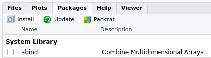

# Ce cours

## Où nous allons {.smaller}

Cinq séances de trois heures, sur machine.

| Séance | Objet |
|:--|:--|
| 1 | Premiers pas : objets, types, vecteurs, fonctions |
| 2 | Découvrir un tableau de données |
| 3 | Décrire des données |
| 4 | Représenter des données |
| 5 | Projet : une analyse complète |

À la fin, vous serez capables de prendre un jeu de données, de le décrire et d'en tirer des graphiques lisibles.

## Comment {.smaller}

::: {.incremental}
- **Un seul jeu de données** pendant tout le cours : l'enquête *Histoires de vie* de l'INSEE. Vous finirez par bien le connaître, et c'est voulu.
- **Une seule famille d'outils** : le `tidyverse`, à partir de la séance 2.
- **Des exercices interactifs** avec `swirl`, à faire en séance et à terminer chez vous. Le temps en salle sert à pratiquer, pas à écouter.
- Chaque séance commence par une reprise de dix à quinze minutes sur la séance précédente.
:::

## Une remarque sur les assistants IA

Vous pouvez tout à fait utiliser ChatGPT, Gemini ou Claude en dehors du cours. 
Ils vous donneront presque toujours une réponse, parfois fausse, et pas toujours simple à comprendre.

::: {.callout-important}
Le problème n'est pas qu'ils se trompent : c'est que vous ne pouvez pas le voir tant que vous ne savez pas faire sans eux.
Ces cinq séances servent à acquérir de quoi les juger.

Pendant les séances, servez-vous de l'aide de R (`?`) et des messages d'erreur. 
C'est ce que vous apprendrez ici.
:::

# Introduction à R

## La console

Au premier lancement de RStudio, l'interface est organisée en trois grandes zones.

```{r rstudio}
#| out-width: '100%'
#| echo: false
#| fig-align: center
#| fig-cap: "Accueil RStudio"
knitr::include_graphics(file.path("resources", "fenetreRStudio.png"))
```

::: {.notes}
La zone de gauche se nomme **la Console**. 
À son démarrage, RStudio a lancé une nouvelle session de R et c'est dans cette fenêtre que nous allons pouvoir interagir avec lui.

Faire la démonstration en direct.
:::

## Console 

La Console affiche un texte de bienvenue suivi d'une ligne commençant par le caractère `>` (l'invite de commande). 

Fournissons une première commande, en saisissant le texte suivant et en appuyant sur `Entrée`.

```{r addition}
2+2
```

Le symbole `>` réapparaît, et nous pouvons lancer d'autres opérations :

```{r calculs}
5-7
4*12
-10/3
5^2
```

## Les opérations arithmétiques

| Math          | code `R`    | Résultat    |
|:-------------:|:-------:|:---------:|
| $3 + 2$       | `3 + 2` | `r 3 + 2` |
| $3 - 2$       | `3 - 2` | `r 3 - 2` |
| $3 \times 2$    | `3 * 2` | `r 3 * 2` |
| $3 \div 2$       | `3 / 2` | `r 3 / 2` |
| $3^2$        | `3 ^ 2`         | `r 3 ^ 2`         |
| $\sqrt{100}$ | `sqrt(100)`     | `r sqrt(100)`     |

: Principales opérations arithmétiques

## Autres fonctions mathématiques {.smaller}

R dispose des fonctions mathématiques usuelles. 
Vous n'en aurez pas besoin dans les prochaines séances, mais elles vous serviront ailleurs.

| Math          | code `R`    | Résultat    |
|:------------:|:---------------:|:-----------------:|
| $\pi$        | `pi`            | `3.141593`            |
| $e$          | `exp(1)`        | `2.718282`        |
| $\ln(x)$         | `log(x)`       | logarithme naturel       |
| $\log_{10}(1000)$ | `log10(1000)`       | `3`       |
| $10^2$       | `1e2`           | `r 1e2`           |

: Constantes et fonctions usuelles

::: {.callout-note}
Attention : il n'y a pas de fonction `ln()` en R. 
Le logarithme naturel s'écrit `log()`.
:::

## Espaces et lisibilité

À de rares exceptions près, les espaces autour des commandes ne sont pas pris en compte.
Les 3 commandes suivantes sont équivalentes :

```{r espaces}
#| eval: false
10+2
10 + 2
10       +         2
```

La pratique standard est d'utiliser la deuxième écriture, afin d'avoir un code lisible.

## R bloqué

Il peut arriver qu'on saisisse une commande incomplète. 
R remplace alors l'invite `>` par un `+` : il attend la suite.

```{r incomplet}
#| eval: false

> 4 *
+
```

::: {.callout-tip}
Complétez la commande, ou appuyez sur `Échap` pour tout annuler et revenir à une invite normale.
:::

# Objets 

## Objets

Nous savons utiliser R comme une calculatrice. 
Pour une utilisation plus avancée, on peut stocker le résultat d'un calcul dans un **objet** à l'aide de l'opérateur d'**assignation** `<-`.

Cette « flèche » stocke ce qu'il y a à sa droite dans un objet dont le nom est indiqué à sa gauche.

```{r assignation}
x <- 2
```

Se lit « prend la valeur 2 et mets-la dans un objet qui s'appelle `x` ».

## Afficher la valeur d'un objet

```{r lecture}
x
```

::: {.notes}
Lors d'une opération d'assignation, R n'affiche pas le résultat de l'opération.
Si on exécute une commande comportant juste le nom d'un objet, R affiche son contenu.
Bien indiquer aux étudiants que l'assignation entraîne un non affichage du résultat.
:::

## Utilisation d'un objet

On peut réutiliser cet objet dans d'autres opérations : R le remplacera alors par sa valeur.

```{r valeur}
x + 4
```

---

On peut créer autant d'objets qu'on le souhaite.

```{r multiple_objets}
x <- 2
y <- 5
resultat <- x + y
resultat
```

---

Si on assigne une nouvelle valeur à un objet, la valeur précédente est perdue.

```{r nouvelle_assignation}
x <- 2
x <- 5
x
```

---

Assigner un objet à un autre copie juste la valeur de l'objet de droite dans celui de gauche.

```{r copie}
x <- 1
y <- 3
x <- y
x
```

## Exercice {.smaller}

Dans la console :

1. Créez un objet `age` contenant votre âge, et un objet `prenom` contenant votre prénom.
2. Créez un objet `annee_naissance` calculé à partir de `age`.
3. Que se passe-t-il si vous tapez `Age` au lieu de `age` ?
4. Peut-on mettre un espace dans un nom d'objet ? Un chiffre au début ?

::: {.notes}
10 minutes. 
La question 3 fait apparaître le premier message d'erreur : ne pas la sauter, elle prépare la section sur les erreurs.
:::

# Types

## Chaîne de caractères

Les valeurs contenues dans les objets peuvent être de différents **types**.

Jusqu'ici on n'a stocké que des nombres, mais un objet peut aussi contenir une *chaîne de caractères* (du texte), qu'on délimite avec des guillemets simples ou doubles (`'` ou `"`) :

```{r chaines}
chien <- "Chihuahua"
chien
```

## Conditions logiques (booléens)

Ou des *conditions logiques* (`TRUE` ou `FALSE`), généralement issues de comparaisons :

```{r booleen}
valeur <- TRUE
valeur

chien == "Doberman"
3 < 2
```

On appelle `TRUE` et `FALSE` des **booléens**.

## Opérateurs logiques {.smaller}

| Opérateur | Résumé | Exemple | Résultat |
|:---------|:---------------------:|:---------------------:|:-------:|
| `x < y`  | `x` plus petit que `y`                | `3 < 42`               | `r 3 < 42`               |
| `x > y`  | `x` plus grand que `y`             | `3 > 42`               | `r 3 > 42`               |
| `x <= y` | `x` plus petit ou égal à `y`    | `3 <= 42`              | `r 3 <= 42`              |
| `x >= y` | `x` plus grand ou égal à `y` | `3 >= 42`              | `r 3 >= 42`              |
| `x == y` | `x` égal à `y`                  | `3 == 42`              | `r 3 == 42`              |
| `x != y` | `x` différent de `y`              | `3 != 42`              | `r 3 != 42`              |
| `!x`     | non `x`                          | `!(3 > 42)`            | `r !(3 > 42)`            |
| `x | y`  | `x` ou `y`     |     `(3 > 42) | TRUE`  | `r TRUE`      |
| `x & y`  | `x` et `y`                      | `(3 < 4) & (42 > 13)` | `r (3 < 4) & ( 42 > 13)` |

::: {.callout-warning}
La comparaison s'écrit `==`, avec deux signes égal. 
Un seul `=` ne compare pas : il assigne. 
C'est l'erreur la plus fréquente au début, et elle ne provoque pas toujours de message.
:::

## Ces opérateurs serviront tout le cours

Vous les retrouverez dès la séance 2, pour sélectionner des lignes dans un tableau :

```{r apercu}
#| eval: false
# Séance 2 : les enquêtés de moins de 25 ans
d |> filter(age < 25)
```

::: .notes

Ignorer pour l'instant le sens du pipe ` |> `.

:::

# Vecteurs

## Vecteurs

Imaginons qu'on ait demandé la taille en centimètres de cinq personnes et qu'on souhaite calculer leur taille moyenne.

On stocke l'ensemble de ces tailles dans un seul objet, un **vecteur** :

```{r tailles}
tailles <- c(156, 164, 197, 147, 173)
tailles
```

où `c()` veut dire « combine les valeurs suivantes dans un vecteur ».

## Opérations sur un vecteur

Une opération appliquée à un vecteur s'applique à chacun de ses éléments :

```{r op_vec}
tailles + 10
tailles^2
```

## Opérations entre vecteurs {.smaller}

Imaginons qu'on ait aussi demandé aux cinq mêmes personnes leur poids en kilos.

```{r poids}
poids <- c(45, 59, 110, 44, 88)
```

On peut alors calculer l'indice de masse corporelle de chacun, en divisant le poids en kilos par la taille en mètres au carré :

```{r imc}
imc <- poids / (tailles / 100) ^ 2
imc
```

::: {.callout-tip}
Une seule ligne calcule les cinq indices. 
C'est le principe central de R : on travaille sur des colonnes entières, pas sur des valeurs une par une.
:::

## Un vecteur a un seul type {.smaller}

Un vecteur peut contenir du texte :

```{r diplome}
diplome <- c("CAP", "Bac", "Bac+2", "CAP", "Bac+3")
diplome
```

Mais pas mélanger les types. Si on essaie, R convertit tout :

```{r coercition}
chiens <- c("Chihuahua", 5, "Doberman", 15)
chiens
```

::: {.callout-warning}
Remarquez les guillemets autour des nombres : R les a transformés en texte, sans prévenir. 
Vous ne pourrez plus faire de calcul avec. 
C'est une source d'erreur classique lors de l'import de données.
:::

## Vecteurs de nombres consécutifs

L'opérateur `:` génère un vecteur contenant tous les entiers entre deux valeurs :

```{r sequence}
x <- 1:10
x
```

## Accès à un élément

On accède à un élément d'un vecteur en faisant suivre son nom de crochets contenant la position voulue.

```{r lecture_vecteur}
diplome[2]
tailles[c(1, 3)]
```

## Affichage dans la console {.smaller}

Si un vecteur contient beaucoup d'éléments, l'affichage est réparti sur plusieurs lignes :

     [1] 294 425 339 914 114 896 716 648 915 587 181 926 489
    [14] 848 583 182 662 888 417 133 146 322 400 698 506 944
    [27] 237 324 333 443 487 658 793 288 897 588 697 439 697

Le nombre entre crochets en début de ligne indique la **position du premier élément de la ligne**. 
Ainsi le 848 est le 14e élément du vecteur.

Ceci explique le `[1]` qui apparaît quand on affiche un simple nombre : pour R, un nombre est un vecteur à un seul élément.

# Fonctions

## Une fonction

Une **fonction** a un *nom*, prend en entrée des *arguments* entre parenthèses, et renvoie un *résultat*.

```{r length}
length(tailles)
mean(tailles)
```

## Arguments {.smaller}

Certaines fonctions prennent plusieurs arguments, qui portent un nom.

```{r arguments}
tailles_incompletes <- c(156, 164, NA, 147, 173)
mean(tailles_incompletes)
mean(tailles_incompletes, na.rm = TRUE)
```

`NA` (*Not Available*) signale une **valeur manquante**. 
La moyenne d'un ensemble contenant une valeur inconnue est inconnue : d'où le premier résultat.

L'argument `na.rm = TRUE` demande d'écarter ces valeurs avant de calculer.

## Aide sur une fonction {.smaller}

On obtient l'aide sur une fonction avec `?` :

```{r help}
#| eval: false
?mean
help("mean")
```

L'aide s'affiche dans le panneau en bas à droite. 
Elle est technique, mais elle est exacte et toujours disponible.

::: {.callout-tip}
Deux rubriques suffisent au début : **Usage**, qui donne la liste des arguments, et **Examples**, tout en bas, que vous pouvez copier dans la console pour voir la fonction à l'œuvre.
:::

## Exercice {.smaller}

Sur le vecteur `imc` calculé plus haut :

1. Combien contient-il de valeurs ?
2. Quel est le plus petit ? le plus grand ? (cherchez les fonctions dans l'aide si besoin)
3. Ouvrez `?quantile`. Que fait l'argument `probs` ?
4. Calculez la médiane des tailles de deux façons différentes.

# Quand ça ne marche pas

## Lire un message d'erreur {.smaller}

R vous parle. 
Ses messages sont brefs, mais ils désignent presque toujours l'endroit exact du problème.

```{r erreur_objet}
#| eval: false
taille
```

    Erreur : objet 'taille' introuvable

::: {.fragment}
R vous dit qu'il ne connaît aucun objet portant ce nom. 
Notre vecteur s'appelle `tailles`, au pluriel.
:::

## Trois erreurs que vous rencontrerez aujourd'hui {.smaller}

```{r erreur_fonction}
#| eval: false
means(tailles)
```

    Erreur : impossible de trouver la fonction "means"

::: {.fragment}
```{r erreur_type}
#| eval: false
"12" + 3
```

    Erreur : argument non numérique pour un opérateur binaire
:::

::: {.fragment}
```{r erreur_parenthese}
#| eval: false
mean(tailles
```

    +

Une parenthèse n'est pas fermée : R attend la suite. 
`Échap` pour annuler.
:::

## La méthode {.smaller}

::: {.incremental}
1. **Lisez la dernière ligne.** 
C'est là qu'est le message.
2. **Repérez le nom cité entre guillemets.** 
C'est presque toujours là qu'est la faute.
3. **Comparez-le à ce que vous avez tapé.** Faute de frappe, singulier au lieu du pluriel, majuscule oubliée : R distingue `age` de `Age`.
4. **Si le nom est correct**, l'objet n'existe pas encore : avez-vous exécuté la ligne qui le crée ?
:::

::: {.fragment}
::: {.callout-important}
Un message d'erreur n'est pas un échec, c'est un diagnostic. 
Le vrai problème, ce sont les codes qui tournent sans rien dire et donnent un résultat faux -- nous en verrons en séance 3.
:::
:::

# Scripts

## Pourquoi un script

Jusqu'ici, nous avons tapé les commandes une à une dans la console. 
Rien n'est conservé : à la fermeture de RStudio, tout est perdu.

Un **script** est un fichier texte contenant vos commandes. 
On le crée avec *File > New File > R Script*. (`Fichier > Nouveau Fichier > Script R`)

```{r script}
#| eval: false
# Tailles et poids de cinq enquêtés
tailles <- c(156, 164, 197, 147, 173)
poids <- c(45, 59, 110, 44, 88)

mean(tailles)
mean(poids)

# Indice de masse corporelle
imc <- poids / (tailles / 100) ^ 2
min(imc)
max(imc)
```

## Exécuter et commenter

- `Ctrl + Entrée` exécute la ligne courante ou la sélection.
- Tout ce qui suit un `#` est ignoré par R : c'est un **commentaire**.

::: {.callout-tip}
Commentez ce que vous cherchez à faire, pas ce que fait la ligne. 
`# calcule la moyenne` au-dessus de `mean(x)` n'apprend rien à personne. 
`# on écarte les non-répondants` est utile.
:::

À partir d'aujourd'hui, travaillez toujours dans un script, jamais directement dans la console.

# Paquets

## Installer une extension {.smaller}

Les fonctions supplémentaires sont distribuées sous forme de **paquets** (*packages*), diffusés sur un réseau de serveurs nommé [CRAN](https://cran.r-project.org/).

On installe un paquet avec `install.packages()`, une seule fois, comme on installe un programme :

```{r install}
#| eval: false
install.packages("questionr")
```



## Charger un paquet {.smaller}

L'installation ne suffit pas : il faut **charger** le paquet à chaque nouvelle session, avec `library()`.

```{r library}
#| eval: false
library(questionr)
```

On regroupe donc en début de script tous les appels à `library` :

```{r librairies}
#| eval: false
library(tidyverse)
library(questionr)
```

::: {.callout-warning}
Si vous obtenez `impossible de trouver la fonction`, c'est presque toujours qu'un `library()` manque en haut du script.
:::

# À vous

## Installer swirl {.scrollable}

`swirl` est un paquet qui vous fait pratiquer R de manière interactive, directement dans la console.

```{r swirl}
#| eval: false
install.packages('swirl')
library(swirl)
```

Indiquons-lui que nous souhaitons travailler en français :

```{r french}
#| eval: false
select_language('french', append_rprofile = TRUE)
```

## Installer le cours

Le cours est disponible sur GitHub, à l'adresse <https://github.com/EliasBcd/InitiationR>. 
On l'installe directement depuis R :

```{r lecon}
#| eval: false
install_course_github("EliasBcd", "InitiationR")
```

## Lancer une leçon {.smaller}

```{r lancement_swirl}
#| eval: false
swirl()
```

- swirl dialogue avec vous et vous demande un nom. 
Donnez votre numéro d'étudiant ou votre nom, et **gardez le même toute l'année**.
- Choisissez le cours « InitiationR », puis la leçon.
- Suivez les instructions dans la console.

Pour aujourd'hui : **Manipulations_simples**, **Types**, **Vecteurs**, **Fonctions**, **Messages d'erreurs** puis **Logique**.

## Fin d'une leçon

À la fin d'une leçon, swirl vous propose de soumettre votre progression.

Répondez « Oui » : R ouvre votre navigateur sur la page Moodle où déposer le fichier `.txt` de la leçon.

::: {.callout-note}
C'est ce dépôt qui valide votre travail. 
Faites-le à chaque leçon terminée.
:::

## Réinstaller le cours

En cas de problème :

```{r reinstallation}
#| eval: false
uninstall_course("InitiationR")
install_course_github("EliasBcd", "InitiationR")
```

## Pour la prochaine séance {.smaller}

::: {.incremental}
1. Terminez les six leçons swirl et déposez-les sur Moodle.
:::

::: {.callout-note}
En option, pour pratiquer davantage : la leçon facultative **Exercice_1**
reprend vecteurs et fonctions de base. Voir
[`LECONS_OPTIONNELLES.md`](https://github.com/EliasBcd/InitiationR/blob/main/LECONS_OPTIONNELLES.md).
:::

::: {.fragment}
Séance prochaine : nous abandonnons les vecteurs saisis à la main pour de vraies données d'enquête.
:::

## Ressources {.smaller}

Pour aller plus loin, ou revoir une notion à votre rythme :

- Le manuel de Julien Barnier, [*Introduction à R et au tidyverse*](https://juba.github.io/tidyverse/), en français et disponible en ligne. Ce n'est pas un travail à faire : une référence à consulter librement, quand vous en avez besoin.

::: {.callout-note}
Rien à lire pour la prochaine séance. Seules les leçons swirl sont attendues entre deux séances.
:::
