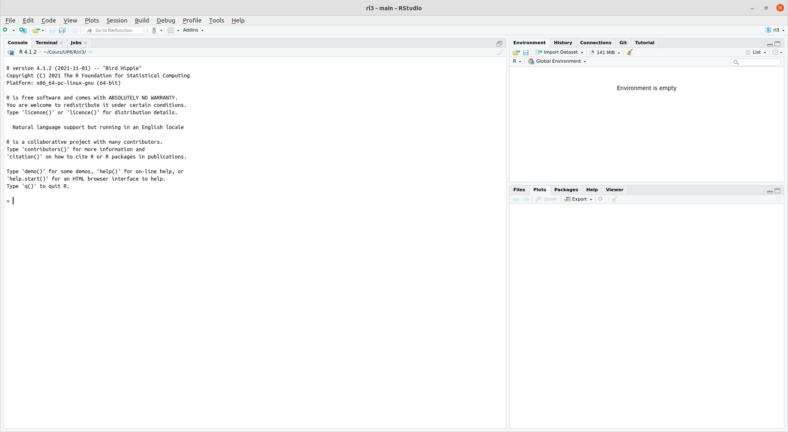

```{r setup, include=FALSE}
options(htmltools.dir.version = FALSE)
knitr::opts_chunk$set(fig.retina = 3, warning = FALSE, message = FALSE)
```


class: left, top
name: Installation

# Installation

Le seul prérequis pour suivre ce cours est d'avoir installé R et RStudio sur votre ordinateur.

Il s'agit de deux logiciels libres, gratuits, téléchargeables en ligne et fonctionnant sous Windows, Mac et Linux.

Pour installer R, il suffit de se rendre sur une des pages suivantes :

[Installer R sous Windows](https://cloud.r-project.org/bin/windows/base/)

[Installer R sous Mac](https://cloud.r-project.org/bin/macosx/)

Pour installer RStudio, rendez-vous sur [la page de téléchargement du logiciel](https://www.rstudio.com/products/rstudio/download/#download) et installez la version adaptée à votre système.

Vous trouverez plus d'informations sur l'installation de R et Rstudio sur le page Moodle du cours.

---
class:inverse
# Prise en main

---
class: left, top


## La console

Au premier lancement de RStudio, l'interface est organisée en trois grandes zones.

```{r, out.width = "600px",echo=FALSE}

```


La zone de gauche se nomme la Console. À son démarrage, RStudio a lancé une nouvelle session de R et c'est dans cette fenêtre que nous allons pouvoir interagir avec lui.
---
La Console affiche un texte de bienvenue suivi d'une ligne commençant par le caractère `>` (l'invite de commande). 


Nous pouvons tout de suite essayer quelques calculs :

```{r}
2+2
```
--

```{r}
5-7
4*12
-10/3
5^2
```

---
## Calculs de base


#### Addition, Sousraction, Multiplication et Division

| Math          | code `R`    | Résultat    |
|:-------------:|:-------:|:---------:|
| $3 + 2$       | `3 + 2` | `r 3 + 2` |
| $3 - 2$       | `3 - 2` | `r 3 - 2` |
| $3 \times 2$    | `3 * 2` | `r 3 * 2` |
| $3 \div 2$       | `3 / 2` | `r 3 / 2` |

#### Exposants

| Math          | code `R`    | Résultat    |
|:-------------:|:-------:|:---------:|
| $3^2$        | `3 ^ 2`         | `r 3 ^ 2`         |
| $2^{(-3)}$   | `2 ^ (-3)`      | `r 2 ^ (-3)`      |
| $100^{1/2}$  | `100 ^ (1 / 2)` | `r 100 ^ (1 / 2)` |
| $\sqrt{100}$ | `sqrt(100)`     | `r sqrt(100)`     |

---

#### Constantes mathématiques 

| Math          | code `R`    | Résultat    |
|:------------:|:---------------:|:-----------------:|
| $\pi$        | `pi`            | `3.141593`            |
| $e$          | `exp(1)`        | `2.718282`        |

#### Logarithmes

Il n'y a pas de `ln()` dans `R`, mais on utilise `log()` pour désigner le logarithme naturel. `log10()` désigne le logarithme en base 10

| Math          | code `R`    | Résultat    |
|:------------:|:---------------:|:-----------------:|
| $\ln(e)$         | `log(exp(1))`       | `1`       |
| $\log_{10}(1000)$ | `log10(1000)`       | `3`       |

#### Trigonometrie

| Math          | code `R`    | Résultat    |
|:------------:|:---------------:|:-----------------:|
| $\sin(\pi / 2)$ | `sin(pi / 2)` | `1` |
| $\cos(0)$       | `cos(0)`      | `1`      |


---

## Objets 

Pour conserver le résultat d'une opération, on peut le stocker dans un objet à l'aide de l'opérateur d'assignation `<-`. Cette “flèche” stocke ce qu'il y a à sa droite dans un objet dont le nom est indiqué à sa gauche.

```{r}
x <- 2
```
Se lit “prend la valeur 2 et mets la dans un objet qui s'appelle `x`”.

--
Si on exécute une commande comportant juste le nom d'un objet, `R` affiche son contenu

```{r}
x
```
--

On peut évidemment réutiliser cet objet dans d'autres opérations : `R` le remplacera alors par sa valeur.
```{r}
x+4
```

---
On peut créer autant d'objets qu'on le souhaite.

```{r}
x <- 2
y <- 5
resultat <- x + y
resultat
```
--

Si on assigne une nouvelle valeur à un objet, la valeur précédente est perdue.

```{r}
x <- 2
x <- 5
x
```
--
Assigner un objet à un autre  copie juste la valeur de l'objet de droite dans celui de gauche

```{r}
x <- 1
y <- 3
x <- y
x
```

---

Les objets peuvent contenir tout un tas d'informations.

Jusqu'ici on n'a stocké que des nombres, mais ils peuvent aussi contenir des chaînes de caractères (du texte), qu'on délimite avec des guillemets simples ou doubles (' ou ") :

```{r}
chien <- "Chihuahua"
chien
```

--

Ou encore des conditions logiques (`TRUE` ou `FALSE`) basées sur des comparaisons

```{r}
valeur <- TRUE
valeur

chien == "Doberman"
3<2
```

---
### Opérateurs logiques

| Opérateur | Résumé | Exemple | Résultat |
|:---------|:---------------------:|:---------------------:|:-------:|
| `x < y`  | `x` plus petit que `y`                | `3 < 42`               | `r 3 < 42`               |
| `x > y`  | `x` plus grand que `y`             | `3 > 42`               | `r 3 > 42`               |
| `x <= y` | `x` plus petit ou égal à `y`    | `3 <= 42`              | `r 3 <= 42`              |
| `x >= y` | `x` plus grand ou égal à `y` | `3 >= 42`              | `r 3 >= 42`              |
| `x == y` | `x` égal à `y`                  | `3 == 42`              | `r 3 == 42`              |
| `x != y` | `x` pas égal à `y`             | `3 != 42`              | `r 3 != 42`              |
| `!x`     | pas `x`                          | `!(3 > 42)`            | `r !(3 > 42)`            |
| <code>x &#124; y</code>  | `x` ou `y`     | <code>(3 > 42) &#124; TRUE</code>      | `r TRUE`      |
| `x & y`  | `x` et `y`                      | `(3 < 4) & ( 42 > 13)` | `r (3 < 4) & ( 42 > 13)` |


---

## Vecteurs

Imaginons qu'on a demandé la taille en centimètres de 5 personnes et qu'on souhaite calculer leur taille moyenne.

On pourrait créer autant d'objets que de tailles et calculer la moyenne

```{r}
taille1 <- 156
taille2 <- 164
taille3 <- 197
taille4 <- 147
taille5 <- 173
(taille1 + taille2 + taille3 + taille4 + taille5) / 5
```

--
Ce n’est clairement pas pratique du tout. On va plutôt stocker l'ensemble de nos tailles dans un seul objet, un vecteur, avec la syntaxe suivante :

```{r}
tailles <- c(156, 164, 197, 147, 173)
```

où le `c()` veut dire "combine les valeurs suivantes dans un vecteur ou une liste"

---
Si on affiche le contenu de cet objet, on voit qu’il contient bien l’ensemble des tailles saisies.

```{r}
tailles
```

--
Si on applique une opération à un vecteur, celle-ci s'applique à toutes les valeurs qu'il contient. 

Si on veut la taille en mètres plutôt qu'en centimètres, on peut faire :
```{r}
tailles_m <- tailles/100
tailles_m
```

---
Imaginons maintenant qu’on a aussi demandé aux cinq mêmes personnes leur poids en kilos.

On peut créer un deuxième vecteur :

```{r}
poids <- c(45, 59, 110, 44, 88)
```

On peut alors effectuer des calculs utilisant nos deux vecteurs `tailles` et `poids`.

On peut par exemple calculer l’indice de masse corporelle (IMC) de chacun de nos enquêtés en divisant leur poids en kilo par leur taille en mètre au carré :
```{r}
imc <- poids / (tailles / 100) ^ 2
imc
```

---

Un vecteur peut contenir des nombres, mais il peut aussi contenir du texte.

Imaginons qu'on a demandé aux 5 mêmes personnes leur type de chien préféré : on peut regrouper l'information dans un vecteur.

```{r}
chiens_pref <-c("Doberman","Chihuahua","Husky","Bouvier Bernois","Labrador")
chiens_pref
```

--
Notons qu'on peut tester l'égalité des éléments d'un vecteur et d'un objet

```{r}
chiens_pref==chien
tailles==147
tailles_m>1.6
```


---

L'opérateur `:` permet de générer rapidement un vecteur comprenant tous les nombres entre deux valeurs, opération assez courante sous R :

```{r}
liste <- 1:10
liste

liste2 <- 10:1
liste2
```

--

Si nous voulons créer une séquence qui ne soit pas limitée aux nombres entiers et qui augmente de 1 à la fois, nous pouvons utiliser la fonction `seq()`.
```{r}
seq(from = 1.5, to = 2.2, by = 0.1)
```

---
### Sous vecteurs

Pour extraire un sous-vecteur (subsetting), c'est-à-dire pour n'en choisir que certains éléments, nous utilisons des crochets, “`[]`”. Par exemple, `x[1]` renvoie le premier élément du vecteur `x`, et `x[3]` renvoie le troisième élément

```{r}
tailles
tailles[1]
tailles[3]
```

--

Nous pouvons également exclure certains indices, en les faisant précéder par un signe `-` .
```{r}
tailles[-2]
```

---

Enfin, on peut faire des sous-ensembles sur la base d'un vecteur d'indices.

```{r}
tailles[1:3]
tailles[c(1,3,4)]
```


Nous pourrions également utiliser un vecteur de valeurs logiques.

```{r}
z = c(TRUE, TRUE, FALSE, TRUE, FALSE)
tailles[z]

```

Ce qui est très pratique pour extraire un sous-vecteur des entrées respectant une condition logique : 
```{r}
tailles[tailles>160]
```
---

## Bases de données

Dans R, les bases de données sont des `data.frame`. Dans une `data.frame`, chaque .red[variable] est stockée comme une colonne, et chaque ligne est une .red[observation].

Pour créer une `data.frame`, on utilise la commande `data.frame()` :
```{r}
base <- data.frame(tailles, poids)
```

Il est possible d'avoir plusieurs bases de données ouvertes simultanément dans une session R. Pour se référer à une variable particulière d'une base, on utilise la syntaxe  `<nom de la base>$<nom de la variable>`

```{r}
mean(base$tailles)
range(base$poids)
```

Si on veut ajouter une variable à une base de données, on utilise la même syntaxe

```{r}
base$imc <- base$poids/(base$taille/100)^2
```


---

## Fonctions

### Principes

Nous savons effectuer des opérations de base sur des nombres et des vecteurs, et stocker des valeurs dans des objets pour pouvoir les réutiliser plus tard.

Pour aller plus loin, nous devons aborder les fonctions qui sont, avec les objets, un deuxième concept de base de R. On utilise des fonctions pour effectuer des calculs, obtenir des résultats et accomplir des actions.

Formellement, une fonction a un nom, elle prend en entrée entre parenthèses un ou plusieurs arguments (ou paramètres), et retourne un résultat.

Prenons tout de suite un exemple. Si on veut connaître le nombre d'éléments du vecteur `tailles` que nous avons construit précédemment, on peut utiliser la fonction `length()`, de cette manière :
```{r}
length(tailles)
```

---

Ici, `length()` est  la fonction, on l'appelle en lui passant un argument entre parenthèses (ici notre vecteur tailles), et elle nous renvoie un résultat, à savoir le nombre d'éléments du vecteur passé en paramètre.

Autre exemple, les fonctions `min()` et `max()` retournent respectivement les valeurs minimales et maximales d’un vecteur de nombres.

```{r}
min(tailles)
max(tailles)
```
La fonction `mean()` calcule et retourne la moyenne d'un vecteur de nombres.

```{r}
mean(tailles)
```

Une fonction peut renvoyer d'autres types de résultats. Par exemple, la fonction `range()` (étendue) renvoie un vecteur de deux nombres, le minimum et le maximum.

```{r}
range(tailles)
```

---

### Arguments

Une fonction peut prendre plusieurs arguments, dans ce cas on les indique entre parenthèses en les séparant par des virgules.

On a déjà rencontré un exemple de fonction acceptant plusieurs arguments : la fonction `c()`, qui combine l'ensemble de ses arguments en un vecteur
```{r}
tailles <- c(156,164,197,147,173)
```
Ici, `c()` est appelée en lui passant cinq arguments, les cinq tailles séparées par des virgules, et elle renvoie un vecteur numérique regroupant ces cinq valeurs.

Supposons maintenant que dans notre vecteur tailles nous avons une valeur manquante (une personne a refusé de répondre, ou notre mètre mesureur était en panne). On symbolise celle-ci dans R avec le code interne `NA`.

```{r}
tailles <- c(156, 164, 197, NA, 173)
tailles
```

---

### Valeurs manquantes

Si on calcule maintenant la taille moyenne à l'aide de la fonction `mean()`, on obtient :
```{r}
mean(tailles)

```

En effet, R considère par défaut qu’il ne peut pas calculer la moyenne si une des valeurs n’est pas disponible. Dans ce cas il considère que la moyenne est elle-même “non disponible” et renvoie donc `NA` comme résultat.

On peut cependant indiquer à `mean()` d'effectuer le calcul en ignorant les valeurs manquantes. Ceci se fait en ajoutant un argument supplémentaire, nommé `na.rm` (abbréviation de NA remove, “enlever les NA”), et de lui attribuer la valeur `TRUE`.

```{r}
mean(tailles, na.rm = TRUE)
```

Mettre le paramètre `na.rm` à `TRUE` indique à la fonction `mean()` de ne pas tenir compte des valeurs manquantes dans le calcul.


---

### Aide sur une fonction

Il est fréquent de ne pas savoir (ou d'avoir oublié) quels sont les arguments d'une fonction, ou comment ils se nomment. On peut à tout moment faire appel à l'aide intégrée à R en passant le nom de la fonction (entre guillemets) à la fonction `help()`.
```{r eval=FALSE}
help("mean")
```

On peut aussi utiliser le raccourci `?mean`.

```{r eval=FALSE}
?mean
```


Ces deux commandes affichent une page (en anglais) décrivant la fonction, ses paramètres, son résultat, le tout accompagné de diverses notes, références et exemples. Ces pages d'aide contiennent à peu près tout ce que vous pourrez chercher à savoir, mais elles ne sont pas toujours d'une lecture aisée.

---

### Regrouper ses commandes dans des scripts

- Jusqu'ici on a utilisé R de manière “interactive”, en saisissant des commandes directement dans la console. Ce n'est pas très pratique pour sauvegarder son travail. De lorsque R ou RStudio redémarre, tout ce qui a été effectué dans la console est perdu.


- On va plutôt  regrouper les commandes dans des scripts (de simples fichiers texte), qui vont garder une trace de toutes les opérations effectuées. En rouvrant les scripts et en réexécutant les commandes qu'ils contiennent on pourra “reproduire” le chargement des données, leur traitement, les analyses et leurs résultats.

- Pour créer un script, il suffit de sélectionner le menu File, puis New file et R script. Une quatrième zone apparaît alors en haut à gauche de l'interface de RStudio. On peut enregistrer notre script à tout moment dans un fichier avec l'extension .R, en cliquant sur l'icône de disquette ou en choisissant File puis Save.

- Un script est un fichier texte brut, qui s'édite de la manière habituelle. À la différence de la console, quand on appuie sur Entrée, cela n'exécute pas la commande en cours mais insère un saut de ligne.


- Pour exécuter une commande dans un script, il faut positionner le curseur sur la ligne de la commande en question, et de cliquer sur le bouton Run dans la barre d'outils juste au-dessus de la zone d'édition du script. On peut aussi utiliser le raccourci clavier Ctrl + Entrée (Cmd + Entrée sous Mac). On peut aussi sélectionner plusieurs lignes avec la souris ou le clavier et cliquer sur Run (ou utiliser le raccourci clavier), et l'ensemble des lignes est exécuté d'un coup.

---

Au final, un script pourra ressembler à quelque chose comme ça :

```{r eval = FALSE}
tailles <- c(156, 164, 197, 147, 173)
poids <- c(45, 59, 110, 44, 88)

mean(tailles)
mean(poids)

imc <- poids / (tailles / 100) ^ 2
min(imc)
max(imc)

```

---
### Commentaires

Les commentaires sont un élément très important d'un script. Il s'agit de texte, ignoré par R, et qui permet de décrire les étapes du script, sa logique, les raisons pour lesquelles on a procédé de telle ou telle manière… Il est primordial de documenter ses scripts avec des commentaires, car il est très facile de ne plus se retrouver dans un programme qu'on a produit soi-même, même après une courte interruption.

Pour ajouter un commentaire, il suffit de le faire précéder d'un ou plusieurs symboles `#`. En effet, dès que R rencontre ce caractère, il ignore tout ce qui se trouve derrière, jussqu'à la fin de la ligne.

On peut donc documenter le script précédent :

```{r eval=FALSE}
# Saisie des tailles et poids des enquêtés
tailles <- c(156, 164, 197, 147, 173)
poids <- c(45, 59, 110, 44, 88)

# Calcul des tailles et poids moyens
mean(tailles)
mean(poids)

# Calcul de l'IMC (poids en kilo divisé par les tailles en mètre au carré)
imc <- poids / (tailles / 100) ^ 2
# Valeurs extrêmes de l'IMC
min(imc)
max(imc)
```

---

## Installer et charger des extensions (packages)

- L'installation de base de R permet de faire énormément de choses, mais le langage dispose en plus d'un système d'extensions permettant d'ajouter facilement de nouvelles fonctionnalités. La plupart des extensions sont développées et maintenues par la communauté des utilisateurs et utilisatrices de R, et diffusées via un réseau de serveurs nommé CRAN (Comprehensive R Archive Network).

- Pour installer une extension, si on dispose d'une connexion Internet, on peut 
    - Cliquer sur le bouton Install de l'onglet Packages de RStudio.
    - Il suffit alors d'indiquer le nom de l'extension dans le champ Package et de cliquer sur Install.
    
- On peut aussi installer des extensions en utilisant la fonction `install.packages()` directement dans la console. Par exemple, pour installer le package `ggplot2` on peut exécuter la commande    

```{r eval=FALSE}
install.packages(ggplot2)
```
---

- Une fois l'extension installée, il faut la “charger” avant de pouvoir utiliser les fonctions qu'elle propose. Ceci se fait avec la fonction `library()`. Par exemple, pour pouvoir utiliser les fonctions de `ggplot2`, vous devrez exécuter la commande suivante :

```{r eval=FALSE}
library(ggplot2)
```

Ainsi, on regroupe en général en début de script toute une série de commandes `library()` qui permettent de charger tous les packages utilisés dans le script. Quelque chose comme 

```{r}
library(ggplot2)
library(haven)
library(tidyr)
```

---
## Exercices

###Exercice 1

Construire le vecteur x suivant :

```{r echo=F}
x <- c(120, 134, 256,  12)
x
```

Utiliser ce vecteur x pour générer les deux vecteurs suivants :
```{r echo=F}
x+100
x*2
```

---

### Exercice 2

On a demandé à 4 ménages le revenu des deux conjoints, et le nombre de personnes du ménage :

```{r}
conjoint1 <- c(1200, 1180, 1750, 2100)
conjoint2 <- c(1450, 1870, 1690, 0)
nb_personnes <- c(4, 2, 3, 2)
```

Calculer le revenu total de chaque ménage, puis diviser par le nombre de personnes pour obtenir le revenu par personne de chaque ménage.

--

### Exercice 3

Dans l'exercice précédent, calculer le revenu minimum et maximum parmi ceux du premier conjoint.
```{r}
conjoint1 <- c(1200, 1180, 1750, 2100)
```

Recommencer avec les revenus suivants, parmi lesquels l'un des enquêtés n'a pas voulu répondre :

```{r}
conjoint1 <- c(1200, 1180, 1750, NA)
```

---
### Exercice 4

Les deux vecteurs suivants représentent les précipitations (en mm) et la température (en °C) moyennes pour chaque mois de l'année pour la ville de Lyon (moyennes calculées sur la période 1981-2010) :

```{r}
temperature <- c(3.4, 4.8, 8.4, 11.4, 15.8, 19.4, 22.2, 21.6, 17.6, 13.4, 7.6, 4.4)
precipitations <- c(47.2, 44.1, 50.4, 74.9, 90.8, 75.6, 63.7, 62, 87.5, 98.6, 81.9, 55.2)
```

Calculer la température moyenne sur l’année.

Calculer la quantité totale de précipitations sur l’année.

À quoi correspond et comment peut-on interpréter le résultat de la fonction suivante ? Vous pouvez vous aider de la page d’aide de la fonction si nécessaire.

```{r}
cumsum(precipitations)
```

Même question pour :
```{r}
diff(temperature)
```

---
### Exercice 5

On a relevé les notes en maths, anglais et sport d'une classe de 6 élèves et on a stocké ces données dans trois vecteurs :

```{r}
maths <- c(12, 16, 8, 18, 6, 10)
anglais <- c(14, 9, 13, 15, 17, 11)
sport <- c(18, 11, 14, 10, 8, 12)
```

Calculer la moyenne des élèves de la classe en anglais.

Calculer la moyenne générale de chaque élève (la moyenne des ses notes dans les trois matières).


Essayez de comprendre le résultat des deux fonctions suivantes (vous pouvez vous aider de la page d’aide de ces fonctions) :
```{r}
pmin(maths, anglais, sport)
pmax(maths, anglais, sport)
```


---
class: inverse

# Premier travail avec les données

---
class: left, top

## Données d'exemple

Nous utiliserons dans ce cours des données issues de l'INSEE : la base "[Histoires de vie 2003](https://www.insee.fr/fr/statistiques/2532244)"

La base est disponible au format `.csv` à l'adresse suivante [https://raw.githubusercontent.com/P8EcoGe/rl3/main/bases/hdv3.csv](https://raw.githubusercontent.com/P8EcoGe/rl3/main/bases/hdv3.csv)

Vous pouvez la charger directement dans `R` à l'aide de la commande `read.csv()`. On va la placer dans un objet nommé `hv3` : 

```{r}
hv3 <- read.csv("https://raw.githubusercontent.com/P8EcoGe/rl3/main/bases/hdv3.csv")
```

Alternativement, vous pouvez enregistrer le fichier sur votre disque dur, puis le charger dans `R` avec 

```{r eval=FALSE}
hv3 <- read.csv("chemin_vers_le_fichier/hdv3.csv")
```

Vous pouvez voir dans l'onglet "Environment" que la base de donnée comprend 2000 observations, et 21 variables 


Si vous souhaitez voir le contenu de la base, vous pouvez utiliser la commande `View()` : 
```{r eval=FALSE}
View(hv3)
```


---

## Structure de la base

Un tableau étant un objet comme un autre, on peut lui appliquer des fonctions. Par exemple, `nrow()` et `ncol()` retournent le nombre de lignes et de colonnes du tableau. `dim()` renvoie les deux

```{r}
nrow(hv3)
ncol(hv3)
dim(hv3)
```

La fonction `names()` retourne les noms des colonnes du tableau, c'est-à-dire la liste de nos variables

```{r}
names(hv3)
```

---
Enfin, la fonction `str()` renvoie un descriptif plus détaillé de la structure du tableau. Elle liste les différentes variables, indique leur type et affiche les premières valeurs.

```{r}
str(hv3)
```

---

## Accéder aux variables, et en créer de nouvelles

On se réfère aux variables à l'aide de l'opérateur `$`, qui permet d'accéder aux colonnes du tableau. On utilisera la syntaxe `nom_de_la_base$nom_de_la_variable` pour désigner une variable particulière d'une base de données.

Par exemple, on peut utiliser la fonction `head()` pour afficher les premières valeurs de la variable `age` de la base stockée dans l'objet `hv3`

```{r}
head(hv3$age)
```

On peut aussi utiliser l’opérateur `$` pour créer une nouvelle variable dans notre base : pour cela, il suffit de lui assigner une valeur.

Par exemple, la variable `heures.tv` contient le nombre d'heures passées quotidiennement devant la télé.

```{r}
head(hv3$heures.tv)
```

---
On peut vouloir créer une nouvelle variable dans notre tableau qui contienne la même durée convertie en minutes. 

On va donc créer une nouvelle variables `minutes.tv` de la manière suivante 

```{r}
hv3$minutes.tv <- hv3$heures.tv * 60
```

On peut alors constater, qu'une nouvelle variable (une nouvelle colonne) a bien été ajoutée à la base de données.

```{r}
head(hv3$minutes.tv)
```

---
## Analyse univariée

### Variable quantitative

Une variable quantitative est une variable de type numérique (un nombre) qui peut prendre un grand nombre de valeurs. On en a plusieurs dans notre jeu de données, notamment l'âge (variable `age`) ou le nombre d'heures passées devant la télé (`heures.tv`).


#### Indicateurs numériques
Pour obtenir un résumé numérique concis d'une variable numérique, on peut utiliser la commande `summary()` : 

```{r}
summary(hv3$heures.tv)
summary(hv3$age)
```

`summary()` donne le minimum, le maximum, la moyenne, les premier second (médiane) et troisième quartile de la distribution. La dernière valeur donne, s'il y en a, le nombre de valeurs manquantes (`NA`) pour la variable. 


---

On peut également obtenir (et, si on le souhaite, sauver dans un objet) les valeurs de chaque élément avec les fonction `min()`, `max()`, `median()`, `mean()` et `quantile()` : 

```{r}
min(hv3$age)
max(hv3$age)
mean(hv3$age)
median(hv3$age)
quantile(hv3$age,prob=0.75) # l'option "Prob=" permet de préciser le quantile souhaité
```

---

Si la variable examinée contient des valeurs manquante, il convient d'inclure l'option `na.rm=TRUE` dans l'appel de la fonction : 

```{r}
mean(hv3$heures.tv)
mean(hv3$heures.tv, na.rm=TRUE)
```

On peut obtenir des indicateurs de dispersion (variance, écart-type) à l'aide des commandes `var()` et `sd()` : 


```{r}
var(hv3$age)
sd(hv3$age)
```

---

#### Représentation graphique

La représentation graphique la plus courante pour présenter la distribution d'une variable quantitative continue est l'histogramme, que l'on obtient à l'aide de la commande `hist()`

.pull-left[
```{r code-first, fig.show="hide", warning=FALSE}
library(ggplot2)

ggplot(hv3, aes(x=age)) +
  geom_histogram()
# hist(hv3$age)
```
]

.pull-right[
```{r, echo=FALSE,out.width = '400px'}
knitr::include_graphics(
  knitr::fig_chunk("code-first", "png")
)
```
]

---
.pull-left[
```{r code-sec, fig.show="hide", warning=FALSE}
# library(ggplot2)


hist(hv3$age)
```
]

.pull-right[
```{r, echo=FALSE,out.width = '400px'}
knitr::include_graphics(
  knitr::fig_chunk("code-sec", "png")
)
```
]

---

.pull-left[
```{r code-second, fig.show="hide", warning=FALSE}
hist(hv3$age, breaks=10)
```
]

.pull-right[
```{r, echo=FALSE,out.width = '300px'}
knitr::include_graphics(
  knitr::fig_chunk("code-second", "png")
)
```
]

.pull-left[
```{r code-trois, fig.show="hide", warning=FALSE}
hist(hv3$age, col = "skyblue",
     main = "Répartition des âges des enquêtés",
     xlab = "Âge",
     ylab = "Effectif",
     breaks = 30)
```
]

.pull-right[
```{r, echo=FALSE,out.width = '300px'}
knitr::include_graphics(
  knitr::fig_chunk("code-trois", "png")
)
```
]
---
Une autre représentation classique est la "Boîte à moustache", que l'on obtient avec la commande `boxplot()` : 

.pull-left[
```{r box1, fig.show="hide", warning=FALSE}
boxplot(hv3$age)
```
]

.pull-right[
```{r, echo=FALSE,out.width = '250px'}
knitr::include_graphics(
  knitr::fig_chunk("box1", "png")
)
```
]

.pull-left[
```{r box2, fig.show="hide", warning=FALSE}
boxplot(hv3$age~hv3$sport,   # La syntaxe y~x permet de représenter la distribution de y pour chaque valeur de x
        col=c("gold","darkgreen"),
        xlab="Pratique d'un sport", ylab="Âge"
        ) 
```
]

.pull-right[
```{r, echo=FALSE,out.width = '250px'}
knitr::include_graphics(
  knitr::fig_chunk("box2", "png")
)
```
]


